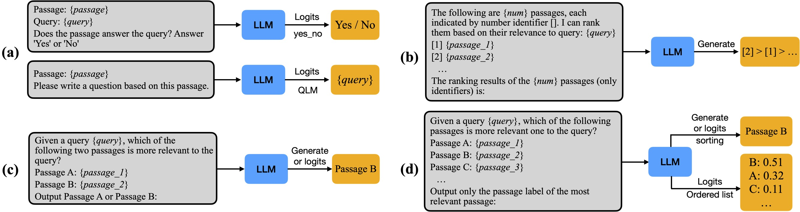

<h1 align="center"> <a href="https://github.com/avnlp/rankers"> Rankers </a> </h1>

<div align="center">

[](https://deepwiki.com/avnlp/rankers)
[](https://github.com/avnlp/rankers/actions/workflows/lint.yml)
[](https://github.com/avnlp/rankers/actions/workflows/tests.yml)
[](https://github.com/avnlp/rankers/blob/main/LICENSE)

</div>

**Paper:** [LLM Rankers](paper/rankers.pdf)

Large Language Models (LLMs) can be efficiently used for document ranking in information retrieval tasks. Compared to traditional methods, LLMs provide more accurate and contextually relevant rankings. The zero-shot capability of LLMs allows them to be used for ranking without extensive training on specific datasets.

We release implementations for three types of LLM-based ranking techniques:

- [Pairwise Ranking](https://arxiv.org/abs/2306.17563)
- [Setwise Ranking](https://arxiv.org/abs/2310.09497)
- [Listwise Ranking](https://arxiv.org/abs/2305.02156)

Our implementation includes modular Pairwise, Setwise, and Listwise ranker components for the [Haystack](https://haystack.deepset.ai/) LLM framework. These rankers leverage structured generation and robust Pydantic validation to ensure accurate zero-shot ranking, even on smaller LLMs.

**Key Features**:

- **Efficient Sorting Algorithms**: The Pairwise and Setwise rankers utilize efficient sorting methods (Heapsort and Bubblesort) to speed up inference.
- **Sliding Window Technique**: The Listwise ranker uses a sliding window approach to handle long lists of candidates efficiently.
- **Integration with RankLLM**: The Listwise ranker integrates with the [RankLLM](https://github.com/castorini/rank_llm) framework and supports LLMs specifically trained for ranking (such as RankGPT, RankLlama, and RankZephyr).
- **Evaluation Toolkit**: We provide a custom Evaluator and Dataloader for evaluating rankers on standard metrics (NDCG, MAP, Recall, Precision) at various cutoffs. The Dataloader efficiently loads and processes datasets using the `ir_datasets` library.

The core sorting and ranking implementation for the Pairwise and Setwise rankers is based on the implementation by [ielab/llm-rankers](https://github.com/ielab/llm-rankers).

## Ranking Techniques



**Different ranking strategies**: (a) Pointwise, (b) Listwise, (c) Pairwise and (d) Setwise. Figure taken from [Setwise Ranking](https://arxiv.org/abs/2310.09497).

### Pairwise Ranking

- In Pairwise ranking, the LLM compares two candidate documents at a time to determine which is more relevant to the query. Each pair is independently fed into the LLM, and the preferred document is recorded.
- To resolve tie-breaking issues, each pair is compared in both orders: "Is A or B better?" and "Is B or A better?" Only when both comparisons agree on a winner is that result used.
- A sorting algorithm aggregates these pairwise preferences into a final ranking by assigning a score to each document based on how often it was preferred. Different sorting methods require different numbers of comparisons:
  - **All-pairs**: Compares every possible pair of documents. Most thorough but requires the most LLM calls.
  - **Heapsort**: Builds a max-heap structure via pairwise comparisons, then extracts the top-k documents. Efficient and commonly used.
  - **Bubblesort**: Iteratively moves the most relevant document to the front via sliding comparisons. Optimized for early termination when ranking stabilizes.

### Setwise Ranking

- Setwise ranking extends the pairwise approach by comparing multiple documents simultaneously. Instead of comparing pairs, the LLM sees N documents at once (typically 3-5) and selects the most relevant one from that set. This reduces the number of inference steps required compared to pairwise ranking.
- The ranking algorithm uses a multi-child heap structure (controlled by `num_child`). Unlike binary heaps in pairwise, each node can have multiple children, matching the set size compared at each step.
- Two sorting methods organize these set-level comparisons:
  - **Heapsort**: Builds a multi-child max-heap, then extracts top-k documents by comparing each parent node against all its children.
  - **Bubblesort**: Uses a sliding window of size `num_child + 1`. At each step, the window compares a subset of documents to find the best one, then moves the window downward until ranking stabilizes.

### Listwise Ranking

- Listwise ranking processes a list of candidate documents in a single step using pre-trained ranking models (RankZephyr, RankVicuna, RankGPT) rather than general-purpose LLMs. These models are trained specifically to rank documents.
- Our implementation uses a sliding window technique: it re-ranks a window of candidate documents, starting from the bottom of the initial ranking and moving upwards. The window moves from lower-ranked documents upward through the initial ranking, reranking each window while incorporating decisions from previous windows.
- The `sliding_window_size` determines how many documents are reranked at once (default: 20). The `sliding_window_step` controls how much the window moves upward after each reranking (default: 10). This approach is integrated with the RankLLM framework and supports specialized ranking models.

## Evaluation

We evaluated the rankers using pipelines built with the Haystack framework. The rankers can be used with any document collection, and we provide evaluation pipelines for the following datasets: FIQA, SciFact, NFCorpus, TREC-19, and TREC-20.

The evaluation pipelines can be found in the [pipelines](src/rankers/pipelines) directory.

**Models Used**:  

- **Pairwise and Setwise Rankers**: `Mistral`, `Phi-3`, and `Llama-3`.
- **Listwise Ranker**: `RankLlama` and `RankZephyr` (models specifically trained for ranking).

**Evaluation Results**:

We report the `NDCG@10` scores for each dataset and method in the table below:

| **Model**        | **Ranker**    | **Method**     | **FiQA**   | **SciFACT** | **NFCorpus** | **TREC-19** | **TREC-20** |
|---------------|------------|-------------|--------:|-----------:|------------:|-----------:|-----------:|
| `Instructor-XL` |     \-    |      \-    | 0.4650 | 0.6920  | 0.4180   | 0.5230  | 0.5040  |
| `Mistral`       | Pairwise  | Heapsort   | 0.4660 | 0.6940  | 0.4270   | 0.7080  | 0.6890  |
| `Mistral`       | Pairwise  | Bubblesort | 0.4660 | 0.6940  | 0.4280   | 0.7090  | 0.6920  |
| `Mistral`       | Setwise   | Bubblesort | 0.4680 | 0.6950  | 0.4300   | 0.7110  | 0.6940  |
| `Mistral`       | Setwise   | Heapsort   | 0.4680 | 0.6960  | 0.4310   | 0.7140  | 0.6950  |
| `Phi-3`         | Pairwise  | Bubblesort | 0.4690 | 0.7060  | 0.4350   | 0.7190  | 0.7010  |
| `Phi-3`         | Setwise   | Bubblesort | 0.4700 | 0.7080  | 0.4360   | 0.7190  | 0.7010  |
| `Phi-3`         | Pairwise  | Heapsort   | 0.4710 | 0.7110  | 0.4380   | 0.7210  | 0.7020  |
| `Phi-3`         | Setwise   | Heapsort   | 0.4710 | 0.7120  | 0.4390   | 0.7220  | 0.7030  |
| `Llama-3`       | Pairwise  | Bubblesort | 0.4730 | 0.7630  | 0.4400   | 0.7390  | 0.7220  |
| `Llama-3`       | Pairwise  | Heapsort   | 0.4740 | 0.7670  | 0.4410   | 0.7410  | 0.7230  |
| `Llama-3`       | Setwise   | Bubblesort | 0.4740 | 0.7720  | 0.4420   | 0.7440  | 0.7250  |
| `Llama-3`       | Setwise   | Heapsort   | 0.4760 | 0.7760  | 0.4430   | 0.7460  | 0.7270  |
| `RankLlama`     | Listwise  | \-         | 0.4796 | 0.7812  | 0.4518   | 0.7511  | 0.7642  |
| `RankZephyr`    | Listwise  | \-         | **0.4892** | **0.7891**  | **0.4578**   | **0.7693**  | **0.7743**  |

- All rankers performed closely across all datasets.
- `RankLlama` and `RankZephyr` (used with the Listwise ranker) consistently achieved slightly better results than the other rankers.
- Among the models not explicitly trained for reranking, the `Llama-3` model with the Setwise and Pairwise ranker performed the best.

## Installation

Clone the repository:

```bash
git clone https://github.com/avnlp/rankers.git
cd rankers
```

Install dependencies using the [`uv`]((https://docs.astral.sh/uv/)) package manager:

```bash
uv sync
```

## Quick Start

The following examples demonstrate initialization and usage of each ranker type. All rankers implement a uniform interface and return ranked documents ordered by relevance.

**Pairwise Ranking** - Compares documents in pairs:

```python
from rankers import PairwiseLLMRanker
from haystack import Document

ranker = PairwiseLLMRanker(
    model_name="meta-llama/Llama-3.1-8B-Instruct",
    method="heapsort",
    top_k=10,
    device="cuda"
)

documents = [Document(content="..."), Document(content="..."), ...]
result = ranker.run(documents=documents, query="your query")
ranked_docs = result["documents"]
```

**Setwise Ranking** - Compares multiple documents simultaneously:

```python
from rankers import SetwiseLLMRanker

ranker = SetwiseLLMRanker(
    model_name="meta-llama/Llama-3.1-8B-Instruct",
    method="heapsort",
    num_child=3,  # Compare 3 documents at a time
    top_k=10,
    device="cuda"
)

result = ranker.run(documents=documents, query="your query")
ranked_docs = result["documents"]
```

**Listwise Ranking** - Uses specialized ranking models:

```python
from rankers import ListwiseLLMRanker

ranker = ListwiseLLMRanker(
    model_path="castorini/rank_zephyr_7b_v1_full",
    ranker_type="zephyr",
    sliding_window_size=20,
    top_k=10,
    device="cuda"
)

result = ranker.run(documents=documents, query="your query")
ranked_docs = result["documents"]
```

## Documentation

- **[Rankers](docs/rankers.md)** - Parameter details, algorithms, and error handling for all ranker types (Pairwise, Setwise, Listwise).
- **[Configuration](docs/configuration.md)** - YAML schemas and examples for all dataset/ranker combinations.
- **[Evaluation](docs/evaluation.md)** - Evaluator API and metrics (NDCG, MAP, Recall, Precision).
- **[Data Loading](docs/dataloader.md)** - Dataloader API for loading datasets from `ir_datasets`.
- **[Advanced Guide](docs/README.md)** - Concepts, patterns, and optimization strategies.
- **[Pipeline Examples](src/rankers/pipelines/)** - End-to-end implementations for all datasets.

## License

This project is licensed under the MIT License - see the [LICENSE](LICENSE) file for details.
